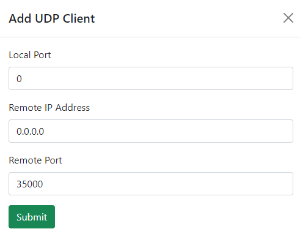
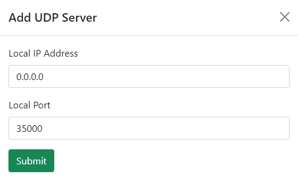
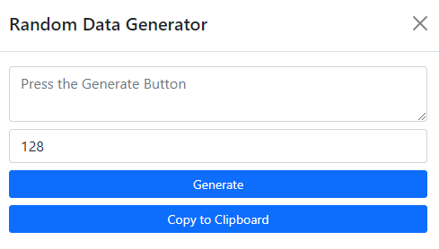
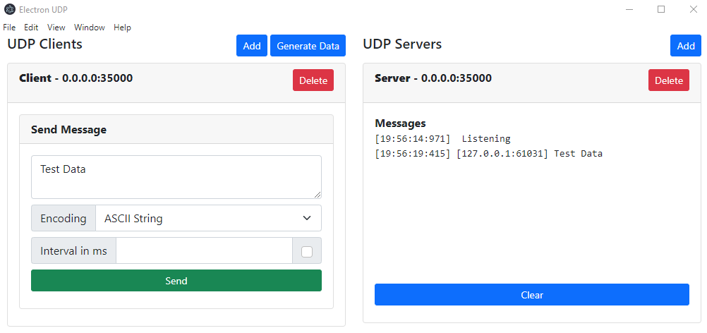

# electron-udp
A simple electron app to create UDP clients and servers to send and receive datagrams. You can add N UDP clients on any host and port and N UDP servers on any host and port. You can also generate random data and send data from the client at a fixed interval. This is a dead simple app to test against other UDP clients or servers. 

## Adding a Client

## Adding a Server

## Data Generator

## Sending and Receiving Messages

## Development
Run `npm install`. During development, you can use `npm start` to start the electron application. 

## Distribution
To build for distribution (exe and associated files) run `npm run build`. Contents will be output to `electron-udp-win32-x64`, specifically `electron-udp.exe`. You can use `electron-packager` to build for other targets. This folder is currently added to the `.gitignore` file. There are other electron packages such as `electron-forge` to build for real distribution.

## License
MIT License

### Fun Notes
First commit was developed within an hour timeframe for prototyping unrelated UDP applications. 
